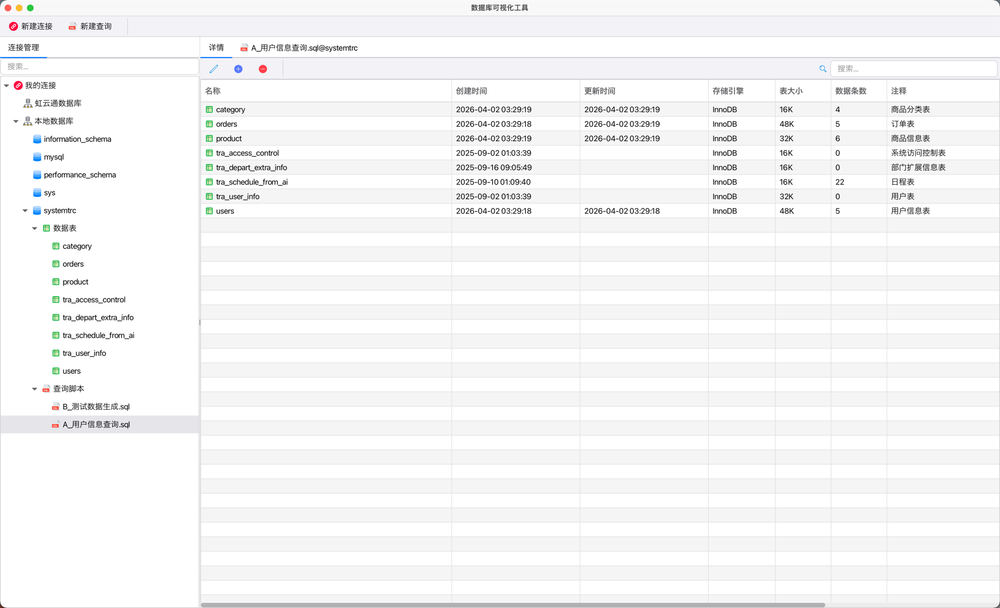

# OpenVDB – 多数据库可视化工具

OpenVDB 是一款面向开发者与数据管理者的现代数据库可视化工具，支持 MySQL、PostgreSQL、SQLite、MongoDB、Redis 等主流数据库，提供统一的图形化操作界面。无需在多个客户端之间切换，即可轻松完成数据浏览、查询编辑、表结构设计、性能监控等日常任务。

## 核心特性
- **多数据库兼容**：一键连接关系型与 NoSQL 数据库，支持 SSH 隧道与云数据库。
- **智能查询编辑器**：语法高亮、自动补全、执行计划分析，提升 SQL 编写效率。
- **可视化数据管理**：表格视图、关系图、JSON/BSON 文档树，直观编辑任意格式数据。
- **导入/导出与备份**：支持 CSV、JSON、Excel 等格式，批量迁移或定时备份数据。
- **安全与协作**：连接加密、团队权限分组、操作日志审计，保障企业级数据安全。

## 适用场景
- 全栈开发、数据分析、数据库运维（DBA）
- 需要同时管理多种数据库的团队或项目
