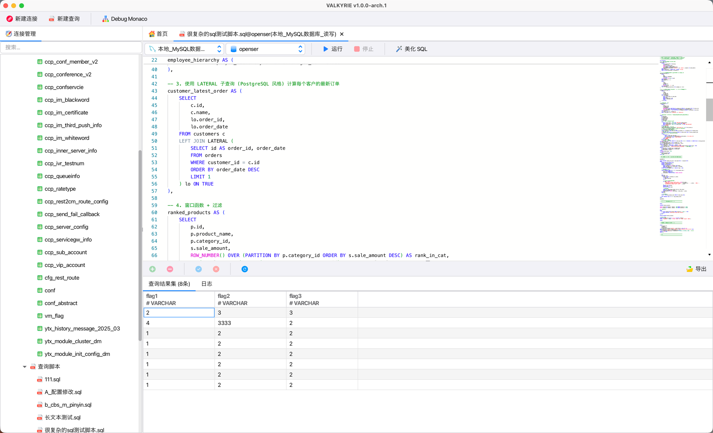
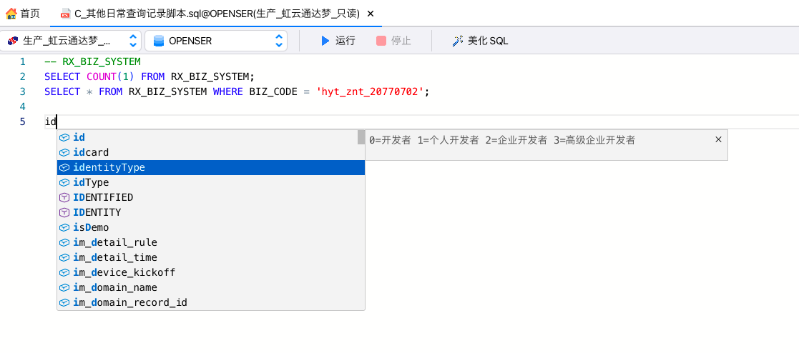

# VALKYRIE DB

VALKYRIE DB 是一款跨平台的数据库可视化工具，集成 VS Code Monaco 编辑器，支持
---

## 核心特性

[点击查看版本更新日志](Documents/v1.0.0-arch.1/README.md)

### 多数据库支持

统一连接和管理多种数据库系统

- MySQL
- Redis 
- 达梦数据库

### SQL 编辑与执行
内置数据库查询编辑器，提供：

- SQL 语法高亮
- 自动补全
- 查询执行
- 提示显示表注释、字段注释

### 可视化数据管理

提供直观的数据浏览与编辑能力：

- 表格数据视图
- 表结构设计
- 关系型数据浏览

支持直接编辑与实时提交数据。

### 数据导入与导出

支持 Excel 导出，可用于数据迁移、批量导入导出及备份。

---

## 构建要求

- JDK21
- OpenJFX SDK 21+
- Maven 3.9.x

---

## 感谢图标作者

- [icons8](https://icons8.com/icons/set/warning--static--red)
- [vectors-market](https://www.flaticon.com/authors/vectors-market)
- [freepik](https://www.flaticon.com/authors/freepik)
- [pixel-perfect](https://www.flaticon.com/authors/pixel-perfect)
- [dimitry-miroliubov](https://www.flaticon.com/authors/dimitry-miroliubov)
- [gowi](https://www.flaticon.com/authors/gowi)
- [srip](https://www.flaticon.com/authors/srip)
- [hqrloveq](https://www.flaticon.com/authors/hqrloveq)
- [amazona-adorada](https://www.flaticon.com/authors/amazona-adorada)
- [fathema-khanom](https://www.flaticon.com/authors/fathema-khanom)
- [customicondesign-1](https://www.flaticon.com/authors/customicondesign-1)
- [Lee.m.yin](https://www.iconfont.cn/user/detail?spm=a313x.search_index.0.d214f71f6.590f3a81Iyg8Pg&uid=6074964&nid=qsTMfc2rGezP)
